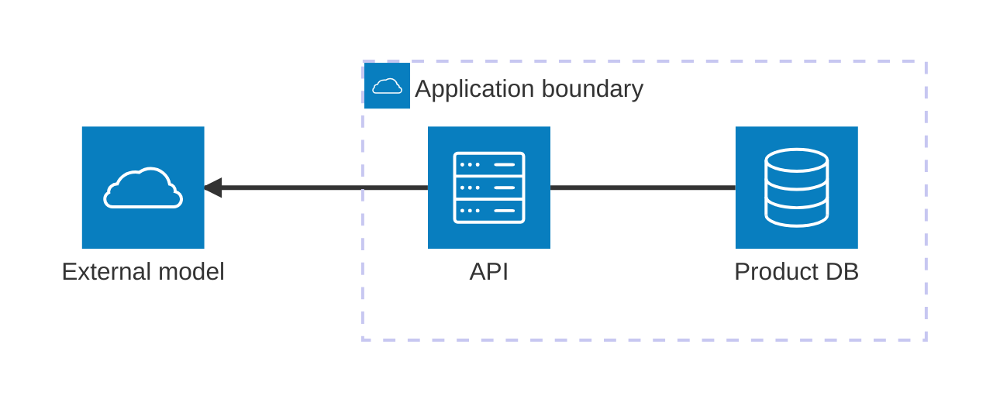

# Architecture

**Choose for:** Service/resource topology, cloud boundaries, storage, and infrastructure connections.

**Prefer another type when:** Not function call order; never equate a library module with a deployed service.

**Semantic / rendering trap:** Use built-in icons for portable examples. External icon packs must be installed/registered separately and can require network access.

## Adaptable example

This is an authored, fictional example, not a description of a live system or measured result.
Replace labels, relationships, and any values with evidence from the user's task.

## Renderer notes

- Compatibility: 11.1.0+.
- Validation baseline and renderer-specific exceptions: [rendering guide](../rendering.md).
- Readability check: verify every intended label, edge, branch, and numerical relationship;
  a successful parse is not sufficient.
- [Official Architecture syntax](https://mermaid.js.org/syntax/architecture.html)
- [Back to selection catalog](../catalog.md)
