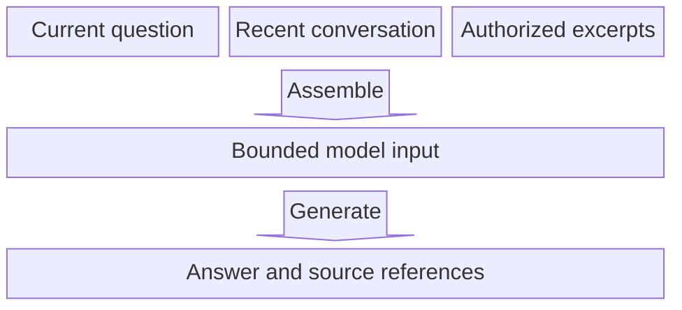

# Block

**Choose for:** Explicitly arranged components, context composition, pipeline stages, and layers.

**Prefer another type when:** Use flowchart when decision routing dominates; use Sankey only for measured quantities.

**Semantic / rendering trap:** Layout is manual. Do not use flowchart pipe-style edge labels: a parser can accept them as unintended blocks. Inspect the result, not only the exit code.

## Adaptable example

This is an authored, fictional example, not a description of a live system or measured result.
Replace labels, relationships, and any values with evidence from the user's task.

## Renderer notes

- Compatibility: See upstream for feature-specific versions.
- Validation baseline and renderer-specific exceptions: [rendering guide](../rendering.md).
- Readability check: verify every intended label, edge, branch, and numerical relationship;
  a successful parse is not sufficient.
- [Official Block syntax](https://mermaid.js.org/syntax/block.html)
- [Back to selection catalog](../catalog.md)
