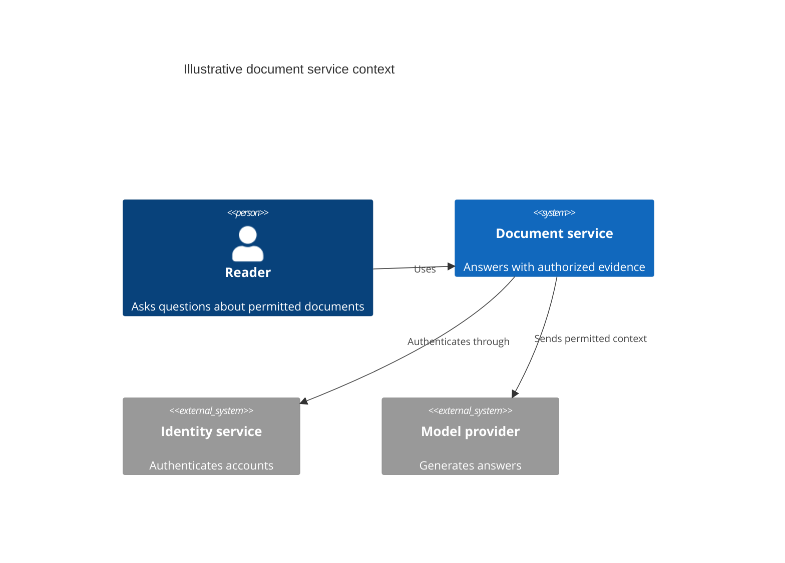

# C4

**Choose for:** System context, deployable containers, components, and architectural boundaries.

**Prefer another type when:** Avoid inventing independently deployed services from module names. Use sequence for one request.

**Semantic / rendering trap:** Choose one C4 level at a time. Here the example is system context, not a deployment inventory; C4 support remains renderer-dependent.

## Adaptable example

This is an authored, fictional example, not a description of a live system or measured result.
Replace labels, relationships, and any values with evidence from the user's task.

## Renderer notes

- Compatibility: See upstream for feature-specific versions.
- Validation baseline and renderer-specific exceptions: [rendering guide](../rendering.md).
- Readability check: verify every intended label, edge, branch, and numerical relationship;
  a successful parse is not sufficient.
- [Official C4 syntax](https://mermaid.js.org/syntax/c4.html)
- [Back to selection catalog](../catalog.md)
