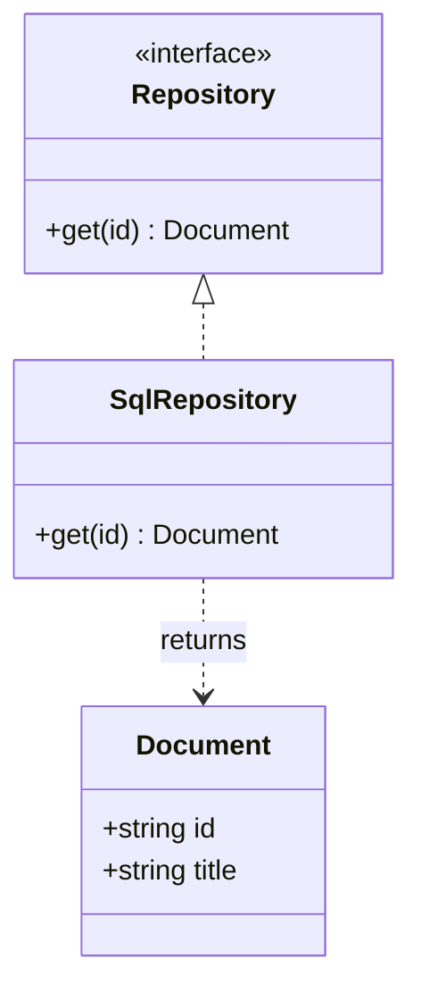

# Class

**Choose for:** Types, interfaces, methods, inheritance, and code-level composition.

**Prefer another type when:** Use ER for physical FK/cardinality questions and sequence for execution.

**Semantic / rendering trap:** Composition means lifecycle ownership, not just a field reference. Avoid implying inheritance when the code only calls another type.

## Adaptable example

This is an authored, fictional example, not a description of a live system or measured result.
Replace labels, relationships, and any values with evidence from the user's task.

## Renderer notes

- Compatibility: See upstream for feature-specific versions.
- Validation baseline and renderer-specific exceptions: [rendering guide](../rendering.md).
- Readability check: verify every intended label, edge, branch, and numerical relationship;
  a successful parse is not sufficient.
- [Official Class syntax](https://mermaid.js.org/syntax/classDiagram.html)
- [Back to selection catalog](../catalog.md)
