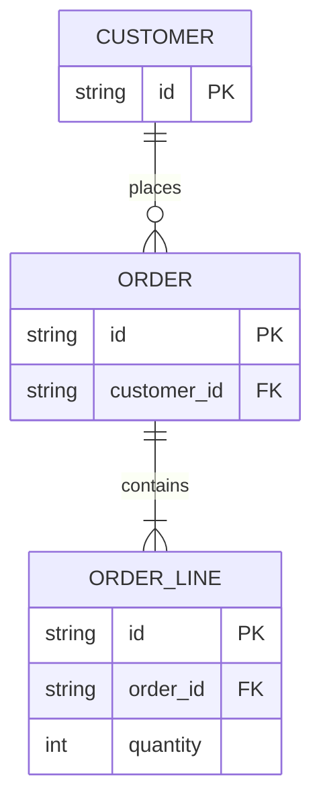

# Entity relationship

**Choose for:** Persistent entities, enforced ownership, cardinality, and logical data models.

**Prefer another type when:** Use class diagrams for behavior/methods. Do not draw app-managed IDs as enforced foreign keys.

**Semantic / rendering trap:** Say whether the model is conceptual or physical. Cardinalities require evidence; partial attribute lists and omitted tables should be explicit.

## Adaptable example

This is an authored, fictional example, not a description of a live system or measured result.
Replace labels, relationships, and any values with evidence from the user's task.

## Renderer notes

- Compatibility: See upstream for feature-specific versions.
- Validation baseline and renderer-specific exceptions: [rendering guide](../rendering.md).
- Readability check: verify every intended label, edge, branch, and numerical relationship;
  a successful parse is not sufficient.
- [Official Entity relationship syntax](https://mermaid.js.org/syntax/entityRelationshipDiagram.html)
- [Back to selection catalog](../catalog.md)
