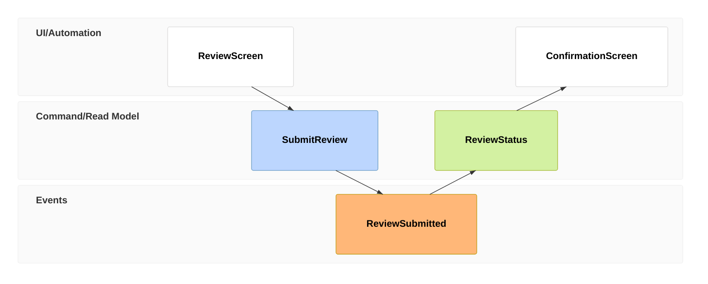

# Event modeling

**Choose for:** Commands, business events, read models, and the information visible to a user.

**Prefer another type when:** Do not imply event sourcing merely because an app logs activity or sends SSE.

**Semantic / rendering trap:** Relations can be inferred. Use reset frames when no causal relationship is intended; keep commands, persisted events and transport messages distinct.

## Adaptable example

This is an authored, fictional example, not a description of a live system or measured result.
Replace labels, relationships, and any values with evidence from the user's task.

## Renderer notes

- Compatibility: 11.15.0+.
- Validation baseline and renderer-specific exceptions: [rendering guide](../rendering.md).
- Readability check: verify every intended label, edge, branch, and numerical relationship;
  a successful parse is not sufficient.
- [Official Event modeling syntax](https://mermaid.js.org/syntax/eventmodeling.html)
- [Back to selection catalog](../catalog.md)
