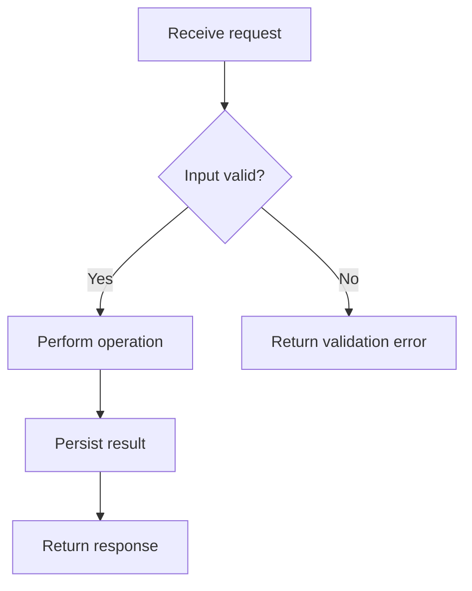

# Flowchart

**Choose for:** Decisions, branching algorithms, fallback paths, and control flow.

**Prefer another type when:** Use swimlanes for ownership or sequence for request/reply timing.

**Semantic / rendering trap:** Quote labels and keep branch outcomes explicit. A graph of every function is usually too large.

## Adaptable example

This is an authored, fictional example, not a description of a live system or measured result.
Replace labels, relationships, and any values with evidence from the user's task.

## Renderer notes

- Compatibility: See upstream for feature-specific versions.
- Validation baseline and renderer-specific exceptions: [rendering guide](../rendering.md).
- Readability check: verify every intended label, edge, branch, and numerical relationship;
  a successful parse is not sufficient.
- [Official Flowchart syntax](https://mermaid.js.org/syntax/flowchart.html)
- [Back to selection catalog](../catalog.md)
