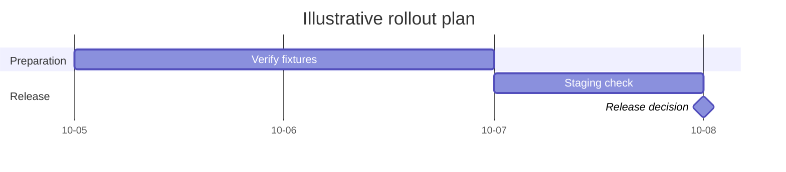

# Gantt

**Choose for:** Schedules, planned dates, dependencies, and measured spans on a time axis.

**Prefer another type when:** Do not infer runtime latency from code or use invented dates in a factual incident report.

**Semantic / rendering trap:** Explicitly label planned versus observed dates. Dependencies and durations should use the same units.

## Adaptable example

This is an authored, fictional example, not a description of a live system or measured result.
Replace labels, relationships, and any values with evidence from the user's task.

## Renderer notes

- Compatibility: See upstream for feature-specific versions.
- Validation baseline and renderer-specific exceptions: [rendering guide](../rendering.md).
- Readability check: verify every intended label, edge, branch, and numerical relationship;
  a successful parse is not sufficient.
- [Official Gantt syntax](https://mermaid.js.org/syntax/gantt.html)
- [Back to selection catalog](../catalog.md)
