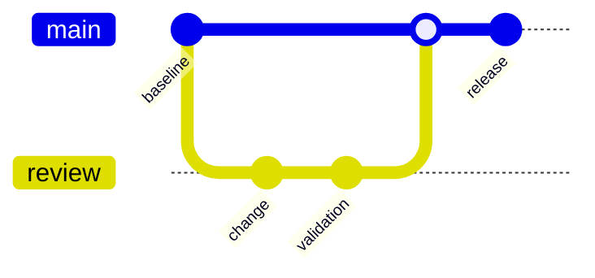

# Git graph

**Choose for:** Commit ancestry, branch strategies, merges, and release histories.

**Prefer another type when:** Do not represent conversation replay, parallel tasks, or database transactions as Git operations.

**Semantic / rendering trap:** Use actual ancestry for a real repo; synthetic commit IDs in this example describe only a proposed workflow.

## Adaptable example

This is an authored, fictional example, not a description of a live system or measured result.
Replace labels, relationships, and any values with evidence from the user's task.

## Renderer notes

- Compatibility: See upstream for feature-specific versions.
- Validation baseline and renderer-specific exceptions: [rendering guide](../rendering.md).
- Readability check: verify every intended label, edge, branch, and numerical relationship;
  a successful parse is not sufficient.
- [Official Git graph syntax](https://mermaid.js.org/syntax/gitgraph.html)
- [Back to selection catalog](../catalog.md)
