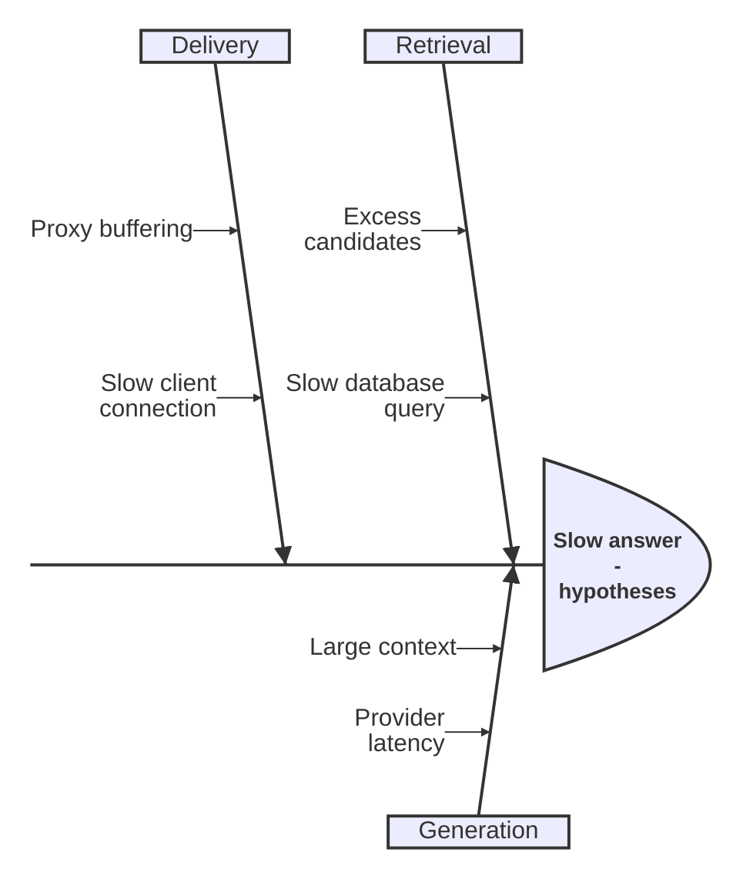

# Ishikawa / fishbone

**Choose for:** Possible causes of an observed problem, grouped by category.

**Prefer another type when:** Not a verified root cause merely because it appears on a branch; not a normal service-flow chart.

**Semantic / rendering trap:** Label hypotheses and evidence separately. Indentation is causal grouping, not a probability or chronology.

## Adaptable example

This is an authored, fictional example, not a description of a live system or measured result.
Replace labels, relationships, and any values with evidence from the user's task.

## Renderer notes

- Compatibility: 11.12.3+.
- Validation baseline and renderer-specific exceptions: [rendering guide](../rendering.md).
- Readability check: verify every intended label, edge, branch, and numerical relationship;
  a successful parse is not sufficient.
- [Official Ishikawa / fishbone syntax](https://mermaid.js.org/syntax/ishikawa.html)
- [Back to selection catalog](../catalog.md)
