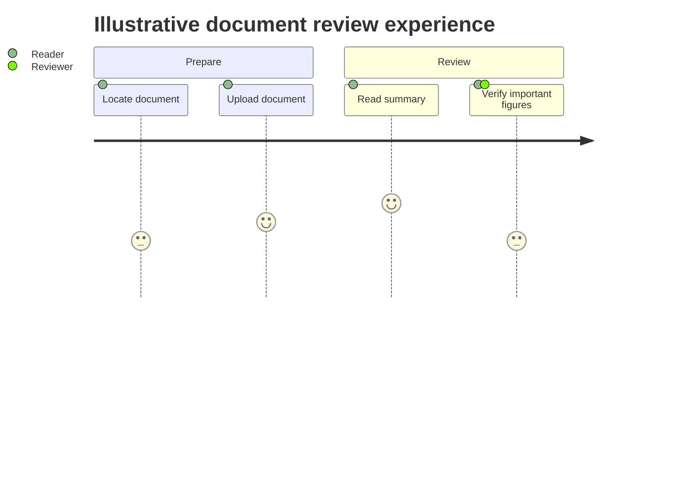

# User journey

**Choose for:** User tasks by phase with observed or explicitly hypothetical experience scores.

**Prefer another type when:** Do not invent satisfaction scores for an architecture walkthrough; use swimlanes instead.

**Semantic / rendering trap:** Scores are 1–5 and encode an assessment, not duration. Example scores below are fictional.

## Adaptable example

This is an authored, fictional example, not a description of a live system or measured result.
Replace labels, relationships, and any values with evidence from the user's task.

## Renderer notes

- Compatibility: See upstream for feature-specific versions.
- Validation baseline and renderer-specific exceptions: [rendering guide](../rendering.md).
- Readability check: verify every intended label, edge, branch, and numerical relationship;
  a successful parse is not sufficient.
- [Official User journey syntax](https://mermaid.js.org/syntax/userJourney.html)
- [Back to selection catalog](../catalog.md)
