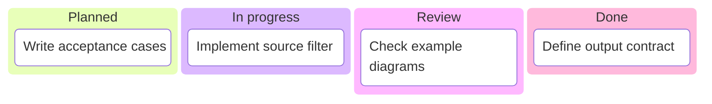

# Kanban

**Choose for:** A work-item snapshot grouped by workflow column or ownership stage.

**Prefer another type when:** Not an authoritative runtime state machine or proof a task completed.

**Semantic / rendering trap:** A card position is a snapshot, not a transition rule; mark fictional example cards.

## Adaptable example

This is an authored, fictional example, not a description of a live system or measured result.
Replace labels, relationships, and any values with evidence from the user's task.

## Renderer notes

- Compatibility: See upstream for feature-specific versions.
- Validation baseline and renderer-specific exceptions: [rendering guide](../rendering.md).
- Readability check: verify every intended label, edge, branch, and numerical relationship;
  a successful parse is not sufficient.
- [Official Kanban syntax](https://mermaid.js.org/syntax/kanban.html)
- [Back to selection catalog](../catalog.md)
