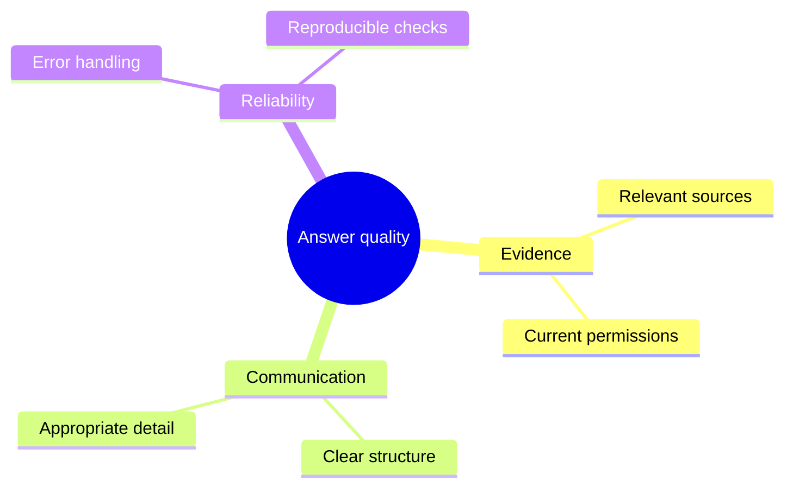

# Mindmap

**Choose for:** Concept taxonomy, brainstorming, and a hierarchy of related concerns.

**Prefer another type when:** Not causality, exact dependencies, state transitions, or time order.

**Semantic / rendering trap:** Indentation defines hierarchy. A shared dependency across branches is usually better shown with block/C4/ER.

## Adaptable example

This is an authored, fictional example, not a description of a live system or measured result.
Replace labels, relationships, and any values with evidence from the user's task.

## Renderer notes

- Compatibility: See upstream for feature-specific versions.
- Validation baseline and renderer-specific exceptions: [rendering guide](../rendering.md).
- Readability check: verify every intended label, edge, branch, and numerical relationship;
  a successful parse is not sufficient.
- [Official Mindmap syntax](https://mermaid.js.org/syntax/mindmap.html)
- [Back to selection catalog](../catalog.md)
