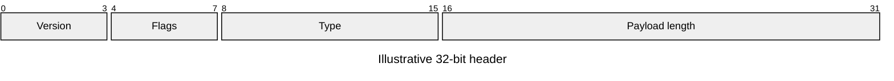

# Packet

**Choose for:** Bit/byte fields of a binary protocol or fixed-width record.

**Prefer another type when:** JSON keys and SSE events are not fixed-width packets.

**Semantic / rendering trap:** State byte order and units in accompanying prose when relevant. Inclusive field ranges must not overlap.

## Adaptable example

This is an authored, fictional example, not a description of a live system or measured result.
Replace labels, relationships, and any values with evidence from the user's task.

## Renderer notes

- Compatibility: 11.0.0+.
- Validation baseline and renderer-specific exceptions: [rendering guide](../rendering.md).
- Readability check: verify every intended label, edge, branch, and numerical relationship;
  a successful parse is not sufficient.
- [Official Packet syntax](https://mermaid.js.org/syntax/packet.html)
- [Back to selection catalog](../catalog.md)
