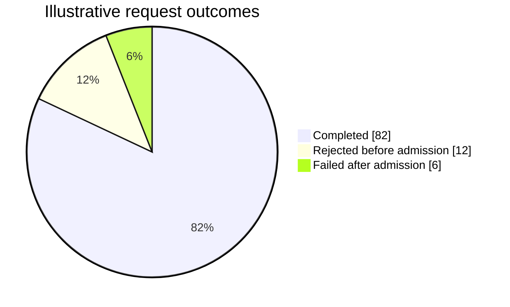

# Pie / donut

**Choose for:** Parts of a meaningful total: measured outcome shares or category proportions.

**Prefer another type when:** Not for control flow, unrelated measures, or negative quantities.

**Semantic / rendering trap:** Keep one denominator and units. Label illustrative data; use a bar chart if differences are hard to compare.

## Adaptable example

This is an authored, fictional example, not a description of a live system or measured result.
Replace labels, relationships, and any values with evidence from the user's task.

## Renderer notes

- Compatibility: See upstream for feature-specific versions.
- Validation baseline and renderer-specific exceptions: [rendering guide](../rendering.md).
- Readability check: verify every intended label, edge, branch, and numerical relationship;
  a successful parse is not sufficient.
- [Official Pie / donut syntax](https://mermaid.js.org/syntax/pie.html)
- [Back to selection catalog](../catalog.md)
