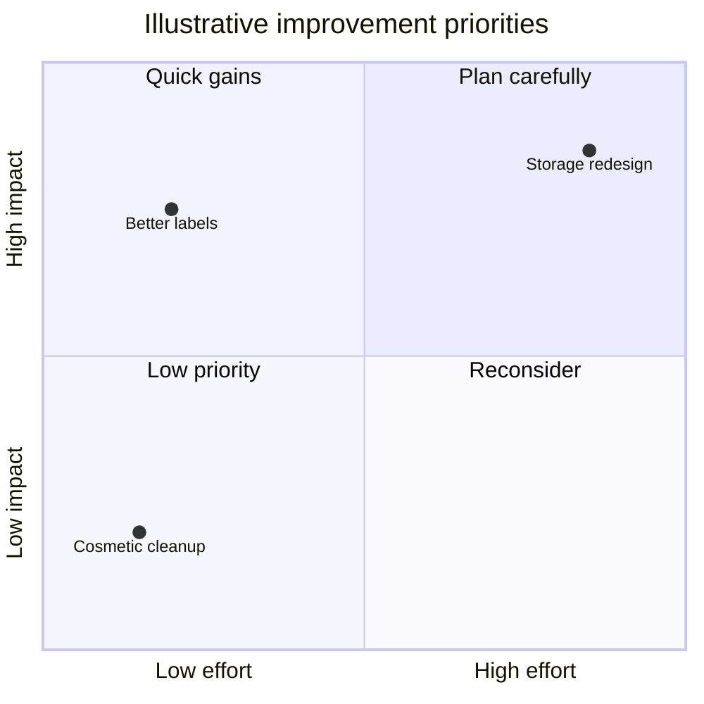

# Quadrant

**Choose for:** Two-axis prioritization or comparison with defined scales and evidence.

**Prefer another type when:** Not a free-form grouping diagram; unmeasured coordinates must be explicitly subjective or illustrative.

**Semantic / rendering trap:** Explain both axes and where high/low sits. Do not present subjective impact/effort as benchmark data.

## Adaptable example

This is an authored, fictional example, not a description of a live system or measured result.
Replace labels, relationships, and any values with evidence from the user's task.

## Renderer notes

- Compatibility: See upstream for feature-specific versions.
- Validation baseline and renderer-specific exceptions: [rendering guide](../rendering.md).
- Readability check: verify every intended label, edge, branch, and numerical relationship;
  a successful parse is not sufficient.
- [Official Quadrant syntax](https://mermaid.js.org/syntax/quadrantChart.html)
- [Back to selection catalog](../catalog.md)
