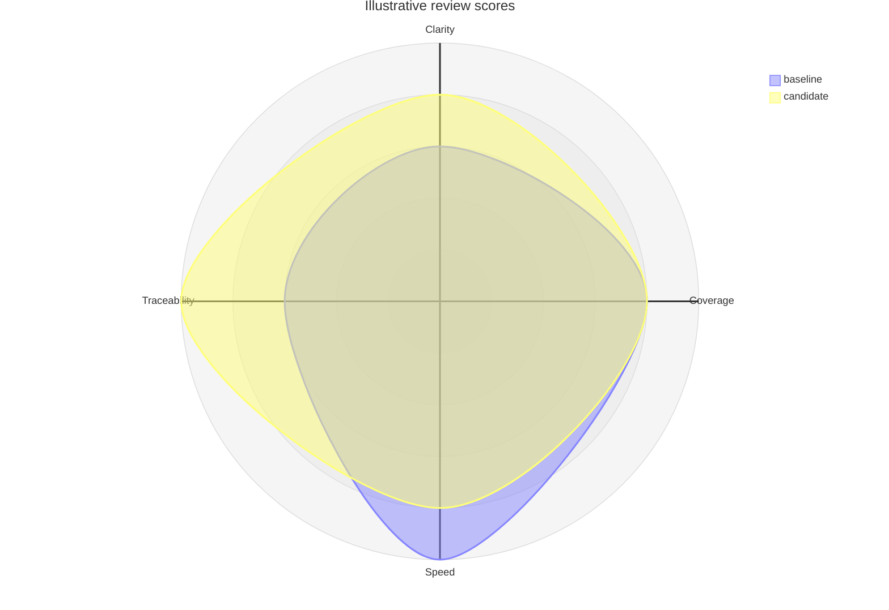

# Radar

**Choose for:** Multiple comparable metrics for a small number of alternatives.

**Prefer another type when:** Do not mix units or hide uncertainty behind a polygon; subjective ratings are not measurements.

**Semantic / rendering trap:** Axes need a common scale and the same desirable direction. All example ratings are illustrative.

## Adaptable example

This is an authored, fictional example, not a description of a live system or measured result.
Replace labels, relationships, and any values with evidence from the user's task.

## Renderer notes

- Compatibility: 11.6.0+.
- Validation baseline and renderer-specific exceptions: [rendering guide](../rendering.md).
- Readability check: verify every intended label, edge, branch, and numerical relationship;
  a successful parse is not sufficient.
- [Official Radar syntax](https://mermaid.js.org/syntax/radar.html)
- [Back to selection catalog](../catalog.md)
