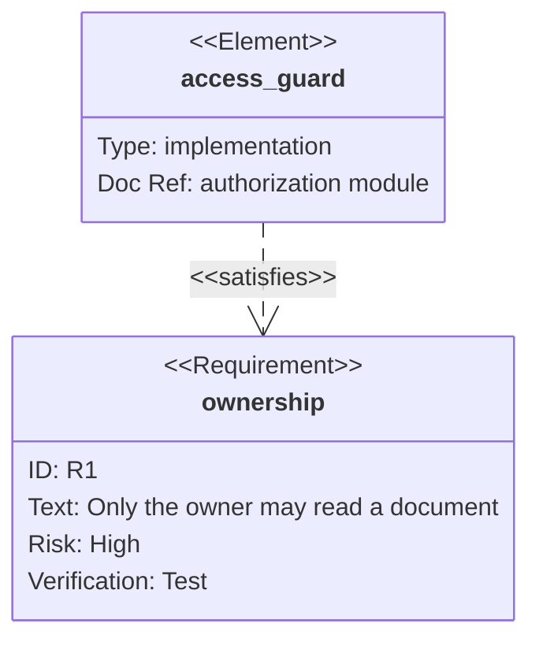

# Requirement

**Choose for:** Requirements linked to implementations, verification methods, and satisfaction evidence.

**Prefer another type when:** Not a runtime flow. A satisfies edge is not proof that a test passed.

**Semantic / rendering trap:** Use real requirement IDs and distinguish desired requirements from verified implementation claims.

## Adaptable example

This is an authored, fictional example, not a description of a live system or measured result.
Replace labels, relationships, and any values with evidence from the user's task.

## Renderer notes

- Compatibility: See upstream for feature-specific versions.
- Validation baseline and renderer-specific exceptions: [rendering guide](../rendering.md).
- Readability check: verify every intended label, edge, branch, and numerical relationship;
  a successful parse is not sufficient.
- [Official Requirement syntax](https://mermaid.js.org/syntax/requirementDiagram.html)
- [Back to selection catalog](../catalog.md)
