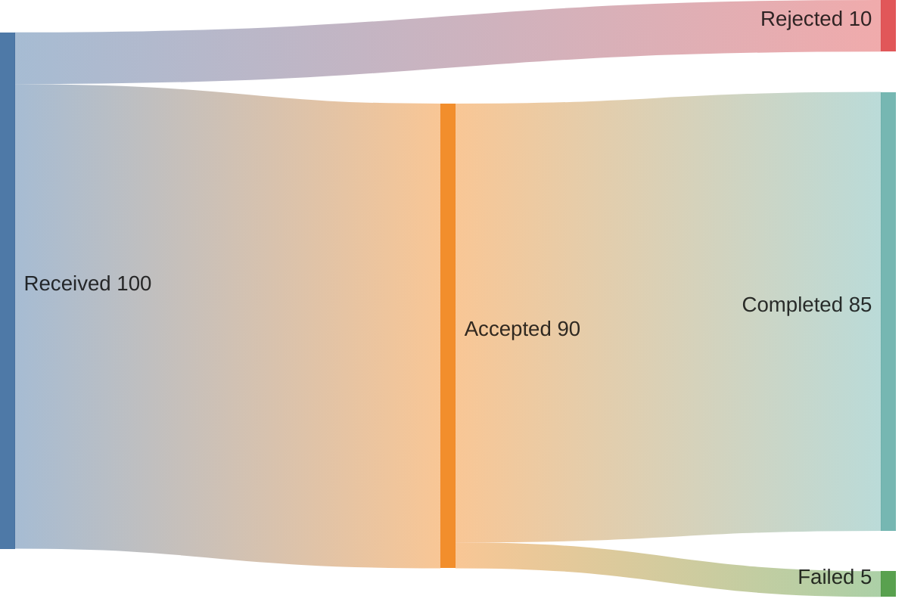

# Sankey

**Choose for:** Quantitative transfers of conserved or explicitly reconciled amounts.

**Prefer another type when:** Not candidate fan-in with duplicate hits, arbitrary control flow, or unmeasured token flows.

**Semantic / rendering trap:** Links require source,target,value. Keep units and conservation clear; the example uses synthetic request counts.

## Adaptable example

This is an authored, fictional example, not a description of a live system or measured result.
Replace labels, relationships, and any values with evidence from the user's task.

## Renderer notes

- Compatibility: 10.3.0+.
- Validation baseline and renderer-specific exceptions: [rendering guide](../rendering.md).
- Readability check: verify every intended label, edge, branch, and numerical relationship;
  a successful parse is not sufficient.
- [Official Sankey syntax](https://mermaid.js.org/syntax/sankey.html)
- [Back to selection catalog](../catalog.md)
