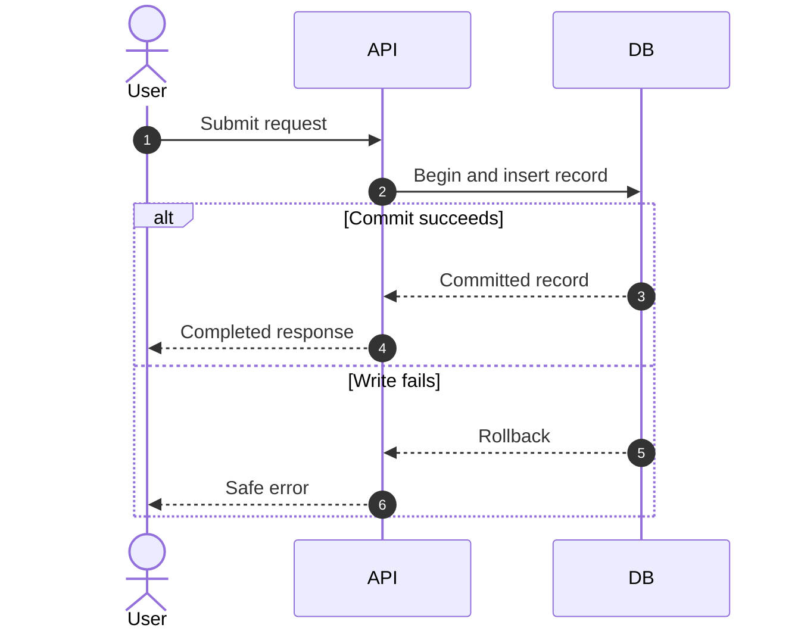

# Sequence

**Choose for:** Ordered calls, asynchronous messages, streaming, transactions, and human resume.

**Prefer another type when:** Use state diagrams for one object lifecycle or ER for stored relationships.

**Semantic / rendering trap:** Keep participants as real responsibilities. Use alt/opt/loop and label provisional versus durable outputs; semicolons in message text can split statements.

## Adaptable example

This is an authored, fictional example, not a description of a live system or measured result.
Replace labels, relationships, and any values with evidence from the user's task.

## Renderer notes

- Compatibility: See upstream for feature-specific versions.
- Validation baseline and renderer-specific exceptions: [rendering guide](../rendering.md).
- Readability check: verify every intended label, edge, branch, and numerical relationship;
  a successful parse is not sufficient.
- [Official Sequence syntax](https://mermaid.js.org/syntax/sequenceDiagram.html)
- [Back to selection catalog](../catalog.md)
