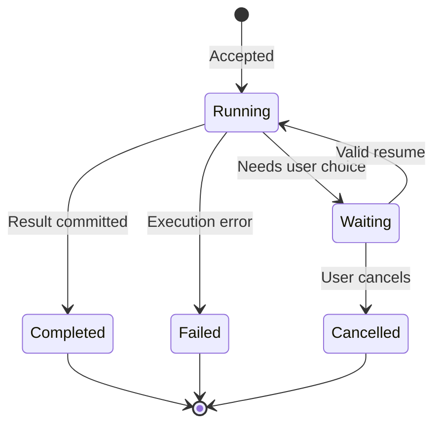

# State

**Choose for:** Legal transitions of a run, order, connection, file, or other identifiable object.

**Prefer another type when:** Do not use runtime states as substitutes for function calls or actor ownership.

**Semantic / rendering trap:** Name the object whose state changes. Separate stored states from conceptual availability; independent resources need separate state regions.

## Adaptable example

This is an authored, fictional example, not a description of a live system or measured result.
Replace labels, relationships, and any values with evidence from the user's task.

## Renderer notes

- Compatibility: See upstream for feature-specific versions.
- Validation baseline and renderer-specific exceptions: [rendering guide](../rendering.md).
- Readability check: verify every intended label, edge, branch, and numerical relationship;
  a successful parse is not sufficient.
- [Official State syntax](https://mermaid.js.org/syntax/stateDiagram.html)
- [Back to selection catalog](../catalog.md)
