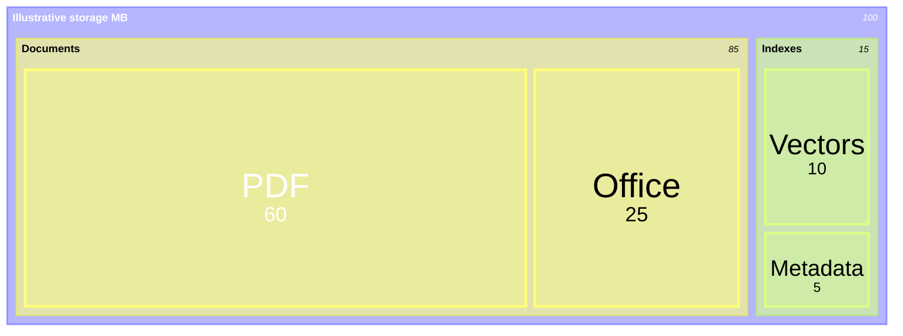

# Treemap

**Choose for:** Hierarchical quantitative composition, such as measured storage by category.

**Prefer another type when:** Not a plain hierarchy or a non-additive score breakdown.

**Semantic / rendering trap:** Rectangle area encodes magnitude. Parent/leaf groupings and units must be explicit; values here are synthetic MB.

## Adaptable example

This is an authored, fictional example, not a description of a live system or measured result.
Replace labels, relationships, and any values with evidence from the user's task.

## Renderer notes

- Compatibility: See upstream for feature-specific versions.
- Validation baseline and renderer-specific exceptions: [rendering guide](../rendering.md).
- Readability check: verify every intended label, edge, branch, and numerical relationship;
  a successful parse is not sufficient.
- [Official Treemap syntax](https://mermaid.js.org/syntax/treemap.html)
- [Back to selection catalog](../catalog.md)
