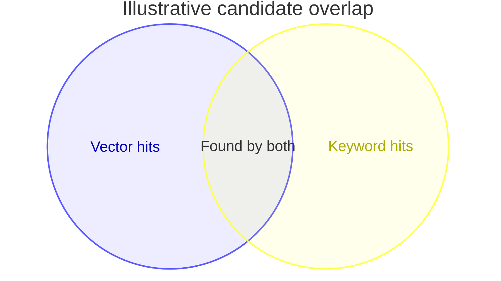

# Venn

**Choose for:** Membership and overlap among a small number of sets.

**Prefer another type when:** Not data lineage, step ordering, or exact proportional quantities without verified set sizes.

**Semantic / rendering trap:** This example is qualitative: circles do not encode measured counts. Do not imply every consulted source is cited.

## Adaptable example

This is an authored, fictional example, not a description of a live system or measured result.
Replace labels, relationships, and any values with evidence from the user's task.

## Renderer notes

- Compatibility: 11.12.3+.
- Validation baseline and renderer-specific exceptions: [rendering guide](../rendering.md).
- Readability check: verify every intended label, edge, branch, and numerical relationship;
  a successful parse is not sufficient.
- [Official Venn syntax](https://mermaid.js.org/syntax/venn.html)
- [Back to selection catalog](../catalog.md)
