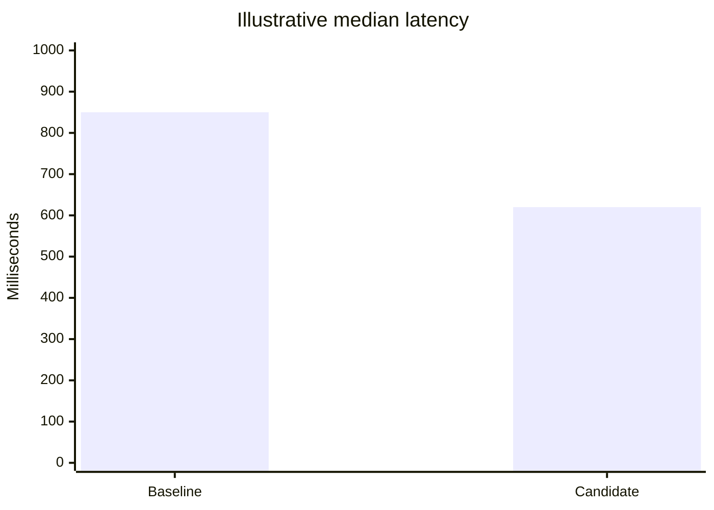

# XY chart

**Choose for:** Measured numeric comparisons and trends, such as latency or quality over time.

**Prefer another type when:** Not topology, causality, or scores with incomparable units.

**Semantic / rendering trap:** Name units and denominator; chart title below marks synthetic data. Use a plotting library for publication-grade statistics.

## Adaptable example

This is an authored, fictional example, not a description of a live system or measured result.
Replace labels, relationships, and any values with evidence from the user's task.

## Renderer notes

- Compatibility: See upstream for feature-specific versions.
- Validation baseline and renderer-specific exceptions: [rendering guide](../rendering.md).
- Readability check: verify every intended label, edge, branch, and numerical relationship;
  a successful parse is not sufficient.
- [Official XY chart syntax](https://mermaid.js.org/syntax/xyChart.html)
- [Back to selection catalog](../catalog.md)
