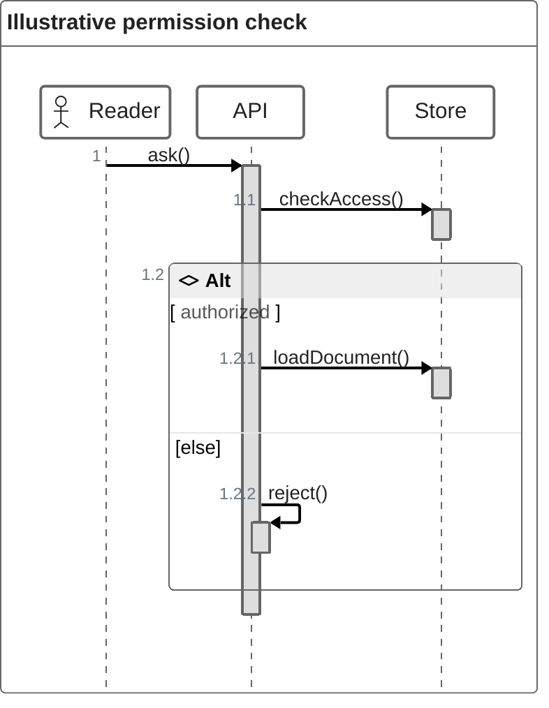

# ZenUML

**Choose for:** Sequence interactions with a code-like DSL, nested calls, and alternatives.

**Prefer another type when:** Prefer native sequenceDiagram if the target cannot load the ZenUML renderer.

**Semantic / rendering trap:** ZenUML is a separate renderer integration. Verify it is registered; a tool that supports Mermaid core need not support ZenUML.

## Adaptable example

This is an authored, fictional example, not a description of a live system or measured result.
Replace labels, relationships, and any values with evidence from the user's task.

## Renderer notes

- Compatibility: See upstream for feature-specific versions.
- Validation baseline and renderer-specific exceptions: [rendering guide](../rendering.md).
- Readability check: verify every intended label, edge, branch, and numerical relationship;
  a successful parse is not sufficient.
- [Official ZenUML syntax](https://mermaid.js.org/syntax/zenuml.html)
- [Back to selection catalog](../catalog.md)
