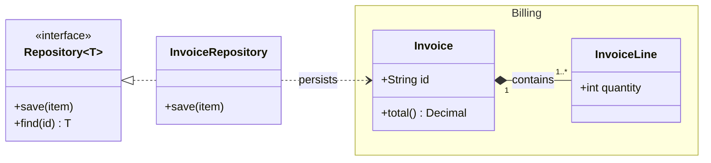

# Class relations, namespaces, and generics

One renderable example for the relation forms, namespace, and generic class summarized in
[syntax essentials](../syntax.md#class). Fictional content.

```mermaid
classDiagram
    direction LR
    namespace Billing {
        class Invoice {
            +String id
            +total() Decimal
        }
        class InvoiceLine {
            +int quantity
        }
    }
    class Repository~T~ {
        <<interface>>
        +save(item)
        +find(id) T
    }
    class InvoiceRepository {
        +save(item)
    }
    Invoice "1" *-- "1..*" InvoiceLine : contains
    Repository <|.. InvoiceRepository
    InvoiceRepository ..> Invoice : persists
```
