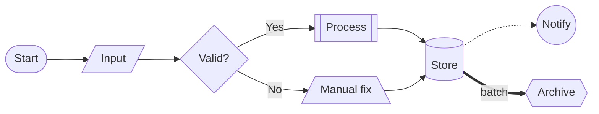

# Flowchart shapes and links

One renderable example for the shape and link forms summarized in
[syntax essentials](../syntax.md#flowchart). Fictional content; replace labels.

```mermaid
flowchart LR
    Start(["Start"]) --> Input[/Input/]
    Input --> Decision{"Valid?"}
    Decision -->|"Yes"| Process[["Process"]]
    Decision -->|"No"| Manual[/Manual fix\]
    Process --> Store[(Store)]
    Manual --> Store
    Store -.-> Notify(("Notify"))
    Store == batch ==> Archive{{"Archive"}}
```
