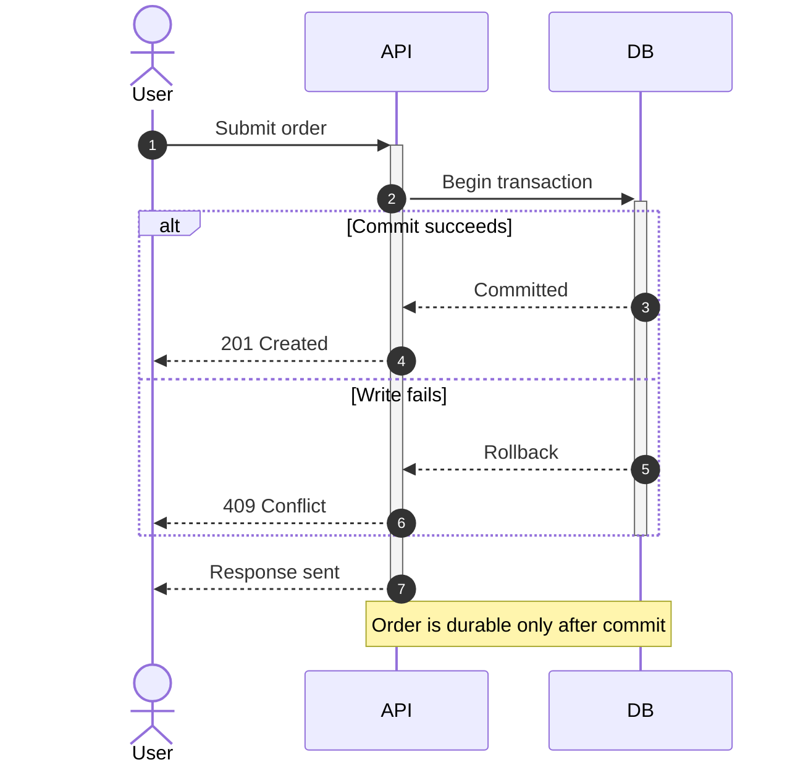

# Sequence blocks and activations

One renderable example for activations and `alt`/`else` blocks summarized in
[syntax essentials](../syntax.md#sequence). Fictional content.

```mermaid
sequenceDiagram
    autonumber
    actor User
    participant API
    participant DB
    User->>+API: Submit order
    API->>+DB: Begin transaction
    alt Commit succeeds
        DB-->>API: Committed
        API-->>User: 201 Created
    else Write fails
        DB-->>API: Rollback
        API-->>User: 409 Conflict
    end
    deactivate DB
    API-->>-User: Response sent
    Note over API,DB: Order is durable only after commit
```
