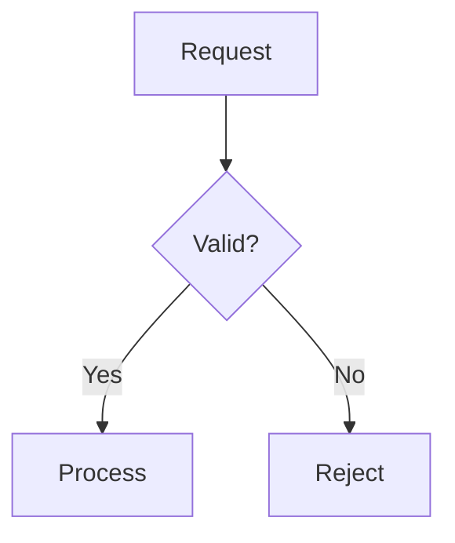

# Termaid

Turn Mermaid source into a diagram the user can see immediately in a monospace
response or terminal. Use the real renderer output, not just a Mermaid source
block or a link to an output file.

## When to use it

- Select this skill autonomously when a spatial explanation is clearer than
  prose: relationships, branches, message order, lifecycles, or timelines.
- Honor explicit requests such as “Use the termaid skill to show this flow.”
  A harness that supports `$termaid` may expose that shorthand; it is not a
  requirement of this skill.
- Do not diagram every answer. Prefer prose for simple facts and small lists.
- This is terminal text rendering, not pixel-identical Mermaid SVG. If the
  user needs browser interactivity, exact visual styling, or image export,
  explain that distinction and use an appropriate renderer instead.

## Runtime: uvx, not a permanent installation

Prerequisites: `uvx` (provided by uv), a compatible Python runtime (3.9+), and
network access for the first package/runtime download. uv may provision Python
and caches its tool environment; “no permanent installation” does not mean
“no downloads or local cache.” Subsequent cached runs may work offline.

These examples were verified with **Termaid 0.8.0**. Use the pinned commands
below for repeatable rendering; no `pip install`, `uv tool install`, project
virtual environment, browser, Node runtime, or running server is needed.

```sh
uvx --from 'termaid==0.8.0' termaid --version
uvx --from 'termaid==0.8.0' termaid diagram.mmd --width 88 --padding-x 1 --padding-y 1 --gap 2
```

For colored output in a terminal that preserves ANSI styling, resolve the
optional Rich dependency in the same disposable, cached uv environment:

```sh
COLUMNS=88 uvx --from 'termaid[rich]==0.8.0' termaid diagram.mmd --theme monokai --width 88 --padding-x 1 --padding-y 1 --gap 2
```

Use `--themes` to list the installed version's themes. If the harness captures
plain text or strips ANSI, use the plain command and show its Unicode output in
a fenced `text` block. Do not put literal escape sequences into the response or
promise color where the output surface cannot display it. Color must not carry
meaning that labels and relationships omit.

Keep Rich's `COLUMNS` equal to the chosen `--width`: captured output otherwise
may wrap at a narrower default even when Termaid's layout fits. This example uses
POSIX shell environment syntax; other runtimes can set the equivalent child
environment. If a known ANSI-capable capture surface disables automatic color
detection, also set `FORCE_COLOR=1`. Do not force color for plain chat output.

If `uvx` is missing or package execution/network access is restricted, explain
the prerequisite. Follow the user's installation/approval policy; do not silently
install another tool globally. Do not bypass restrictions with an online renderer.

## Rendering workflow

1. **Ground the content.** Inspect relevant evidence for a real system. Mark
   hypothetical architectures and illustrative chart data as such. Do not
   invent metrics, dates, dependencies, or relationships for a factual diagram.
2. **Pick the type.** Open [the example index](references/examples.md), then read
   only the example for the needed type. All 18 types have runnable `.mmd` files.
3. **Write source.** Create a UTF-8 `.mmd` file using the harness's file-writing
   facility. Use a temporary directory for an explanation; keep a project file
   only when a durable diagram is requested or follows the project's convention.
   Never interpolate arbitrary diagram text into shell command strings.
4. **Render.** Execute the pinned one-shot command with that file's path as an
   argument. Resolve bundled example paths relative to this skill's directory,
   not the user's project cwd. Quote paths with spaces, or use an argument array.
5. **Inspect.** Check the exit status, stderr, and complete rendered output.
   Confirm labels, edge directions, cardinalities, branches, and values survive.
   A successful parse alone is not proof of a faithful diagram. Unsupported
   syntax can be omitted or simplified by a partial Mermaid implementation.
6. **Fit.** Set `--width` for the actual available screen width; use about 88
   columns when it is unknown. This is best-effort compaction, not a guarantee.
   If output still overflows, shorten labels, use a vertical layout, or split the
   diagram. Never hard-wrap or crop box-drawing output to make it fit. For a
   limited terminal, retry with `--ascii` and check the result.
7. **Deliver.** Put a one-sentence takeaway before the actual diagram, then add
   only useful interpretation. Show captured plain output verbatim in a fenced
   `text` block, or emit colored output on a genuinely user-visible terminal
   surface. Hidden tool output and a file path alone are not delivery. Include
   Mermaid source separately only when useful or requested.
8. **Clean up.** Remove only temporary files created for this rendering after
   delivering/capturing the result. Never remove user-provided source diagrams.

If rendering fails, report the real error and simplify the unsupported construct
without changing its meaning. Rerender and inspect the correction. Do not draw a
plausible-looking replacement by hand and claim Termaid produced it. If the type
is unsupported, say so; offer a clearly labeled alternative only if it preserves
what the user needs.

## Quick example

This is an illustrative request-validation flow, not a claim about the user's
system. Write the following as `diagram.mmd`, then run the plain command above:



Return the renderer's output in the response. Do not assume the user's chat
client understands a `mermaid` fence: the point of this skill is to display the
rendered diagram even when it does not.

## Supported types and boundaries

See [references/examples.md](references/examples.md) for runnable examples of:
flowchart, sequence, class, ER, state, block, git graph, Gantt, architecture, pie,
treemap, mindmap, XY chart, user journey, packet, timeline, kanban, and quadrant.

- Mermaid support is a subset, not the full browser Mermaid implementation.
  Do not assume C4, Sankey, requirement, or other unlisted types are supported.
- `architecture-beta` is the supported architecture type; it is not C4 syntax.
- Pie syntax is intentionally rendered as horizontal bars, not a circle.
- Browser themes, icon packs, CSS, animations, hyperlinks, and arbitrary Mermaid
  directives are not a portable terminal styling contract. Use Termaid's own
  options and verify any unfamiliar syntax.
- Charts and wide sequences may need smaller datasets or multiple views. Never
  silently discard meaningful data to fit the screen.
- No web upload is required: rendering is local. Keep private diagram content
  out of third-party websites. uv's package downloads are separate from diagram
  rendering.
- Do not start `--tui`, a pager, a browser, or a separate terminal pane by default.
  Those are interactive workflows requiring appropriate user intent and runtime
  support. The default is a finite command followed by a visible response.

## Portability and maintenance

This directory is a standalone skill: copy it, including `references/` and
`examples/`, into any harness's documented skills directory. It depends on no
harness-specific tool name, extension API, shell hook, multiplexer, or absolute
installation path. Use the host's available file and command tools.
Reload skill discovery or start a new agent session after installation, according
to the harness's documented behavior. An existing conversation may retain a
cached skill list and not discover a newly installed skill immediately.

When changing the runtime pin, check the new CLI help and rerender every bundled
example, including the Rich and ASCII modes, before claiming compatibility.

Sources: [Termaid](https://termaid.com/),
[upstream documentation](https://github.com/fasouto/termaid),
[uv tool execution](https://docs.astral.sh/uv/guides/tools/).
